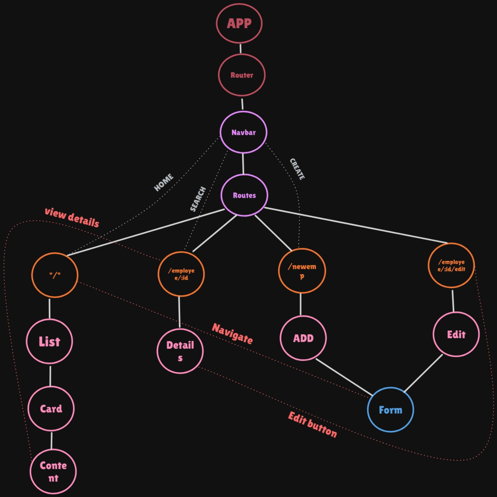

# Employee Mangager

The Employee Manager project is a web application designed to manage employee information efficiently. It provides functionalities for adding, viewing, and deleting employee records. The application features a user-friendly interface built with React and Bootstrap, allowing for easy navigation and interaction. It includes forms for inputting employee details such as name, address, contact information, and more. The project is structured to support routing and component-based architecture, ensuring scalability and maintainability.
## Table of Contents

- [Installation](#installation)
- [Features](#features)
- [Component](#component)

## Installation

Instructions on how to install and run this project.

**Clone the repository**
```sh
 git clone https://github.com/ashhugoel/Employee-Manager.git
  ```

**Navigate into the project directory**
```sh
cd Employee-Manager
```

**Install dependencies**
```sh
npm install
  ```
**To start**
```sh
npm run dev
  ```
## Features
- **Add Employee**: Easily add new employees with their name, address, and contact information using a user-friendly form.
- **View Employee Details**: Access detailed information of each employee, including their full address and contact details.
- **Delete Employee**: Remove employees from the list with a simple click, ensuring your data remains up-to-date.
- **Routing Support**: Utilizes `react-router-dom` for seamless navigation between different pages of the application.
- **Component-Based Architecture**: The project uses React components, making it easy to manage and scale.
- **Form Validation**: Ensures all necessary employee information is correctly entered before submission.
- **Real-Time Updates**: Changes to the employee list reflect immediately, providing a dynamic user experience.

## Component

### `App`
- **Description**: The main component that wraps the entire application and includes the router and navigation.

### `Router`
- **Description**: Manages the routing within the application using React Router for navigation.

### `Navbar`
- **Description**: The navigation bar that allows users to navigate between different routes like Home, Add Employee, and Search.

### `Routes`
- **Description**: Defines the various routes in the application.

  - **`/`**: The home route displaying the list of employees.
    - **`List`**: Displays a list of employees.
    - **`Card`**: Displays an individual employee card.
    - **`Content`**: Contains the details of an individual employee.

  - **`/employee/:id`**: The route to view details of a specific employee.
    - **`Details`**: Displays detailed information about a specific employee.

  - **`/newemp`**: The route to add a new employee.
    - **`Add`**: The component to add a new employee.
    - **`Form`**: The form component to input employee details.

  - **`/employee/:id/edit`**: The route to edit an existing employee's details.
    - **`Edit`**: The component to edit employee details.
    - **`Form`**: The form component to update employee details.


